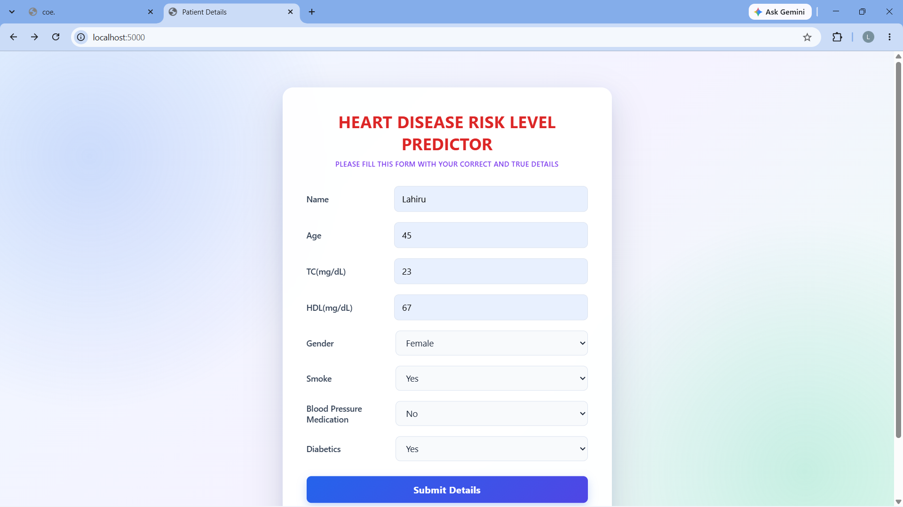
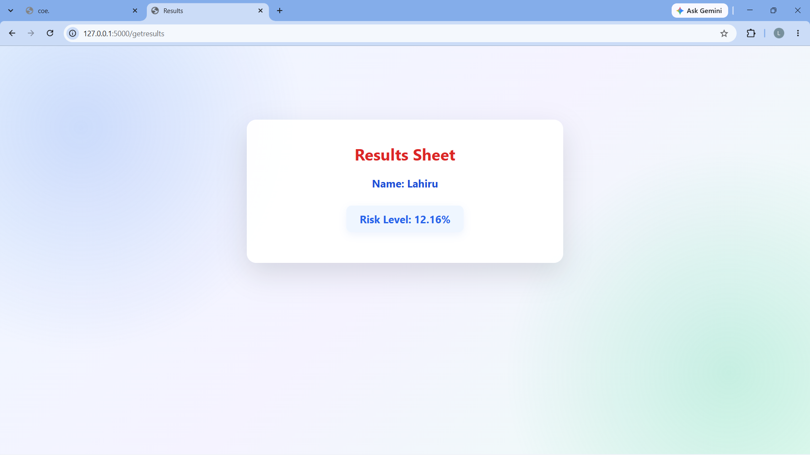

# 🫀 CardioPulse AI - Heart Disease Risk Level Predictor

CardioPulse AI is a Deep Learning-based web application designed to predict a patient's heart disease risk level using clinical health parameters. Built with TensorFlow/Keras and Flask, this tool offers an intuitive interface for real-time risk assessment.

---

## 📸 User Interface Preview

#### Input Form


---

#### Prediction Results


---

## ✨ Features

- **Deep Learning Model**: Uses a Feedforward Neural Network (FFNN) built with Keras & TensorFlow for regression predictions.
- **Model Checkpointing**: Automatically saves the best-performing model based on validation loss (`val_loss`).
- **Feature Preprocessing**: Scales input features and target values using Scikit-Learn's `MinMaxScaler`.
- **Modern Web Interface**: Clean Glassmorphism UI built with HTML5, CSS3, and Flask.

---

## 📊 Clinical Input Features

The model uses 7 key clinical features to estimate heart disease risk:
1. **Gender**
2. **Age**
3. **Total Cholesterol (TC)**
4. **HDL Cholesterol**
5. **Smoking Status**
6. **Blood Pressure Medication**
7. **Diabetes Status**

---

## 🛠 Tech Stack

- **Machine Learning / Deep Learning**: Python, TensorFlow / Keras, Scikit-Learn, Pandas, NumPy
- **Backend Framework**: Flask
- **Frontend**: HTML5, CSS3 (Glassmorphism UI)
- **Tools**: Jupyter Notebook, VS Code

---

## 📁 Project Structure

```text
CardioPulse-AI/
├── model/
│   ├── data/
│   │   └── cardio_dataset.csv         # Training dataset
│   ├── models/                        # Saved checkpoint models
│   ├── scaler_data.sav                # MinMaxScaler for inputs
│   ├── scaler_target.sav              # MinMaxScaler for target
│   └── training_notebook.ipynb        # Neural Network training script
│
└── webapp/
    ├── images/                        # UI screenshots for README
    ├── static/
    │   └── style.css                  # UI Stylesheet
    ├── templates/
    │   ├── patient_details.html       # Input form page
    │   └── patient_results.html       # Risk level display page
    ├── main.py                        # Flask server logic
    └── webapp_requirements.txt        # Web app dependencies
